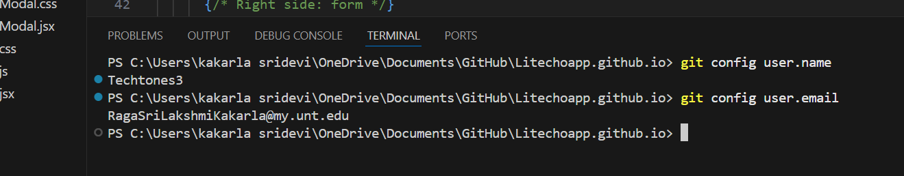
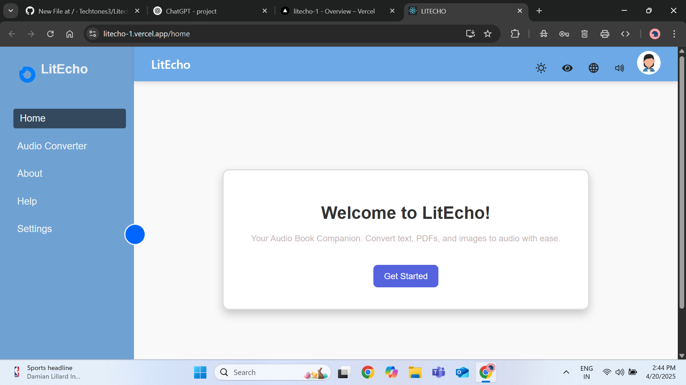
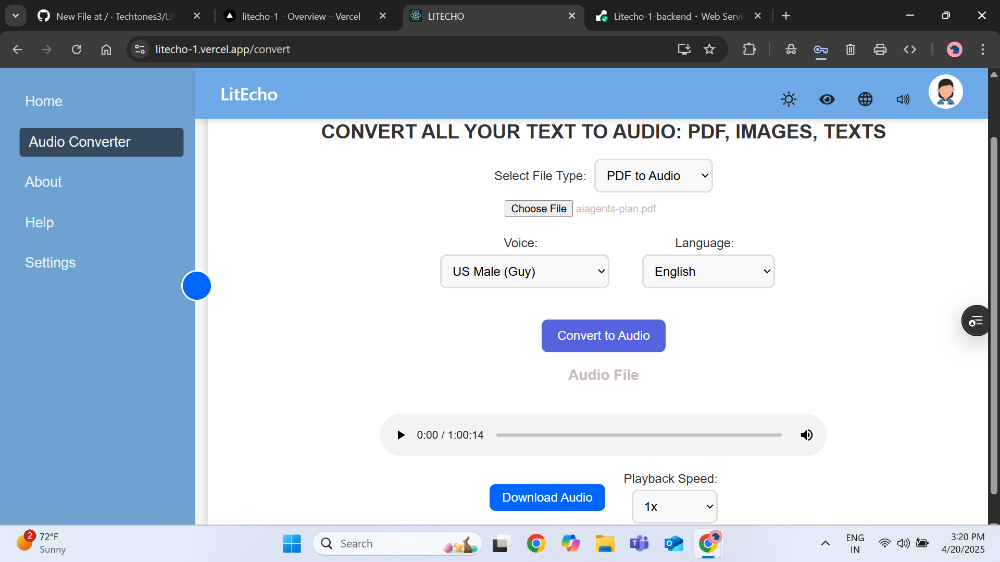
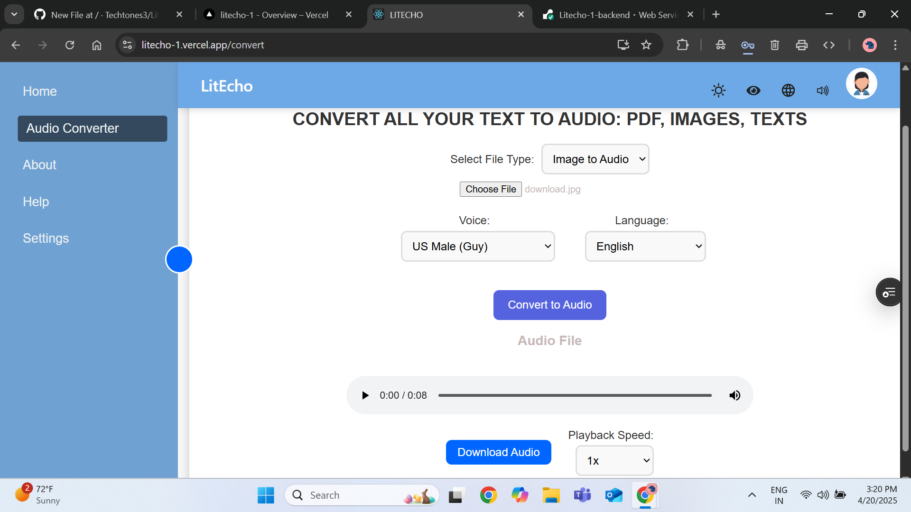
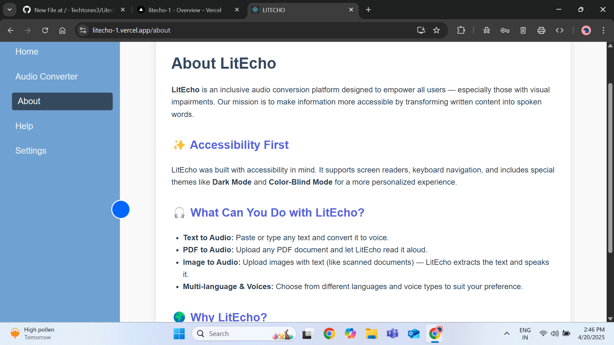
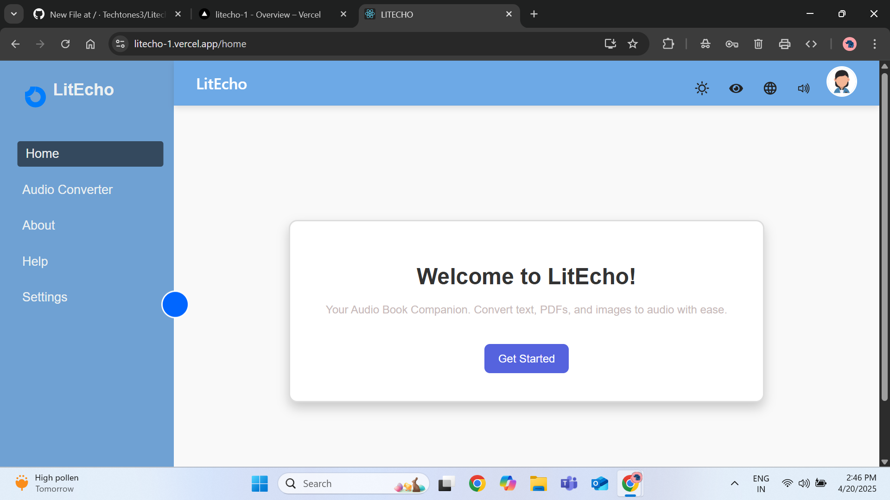
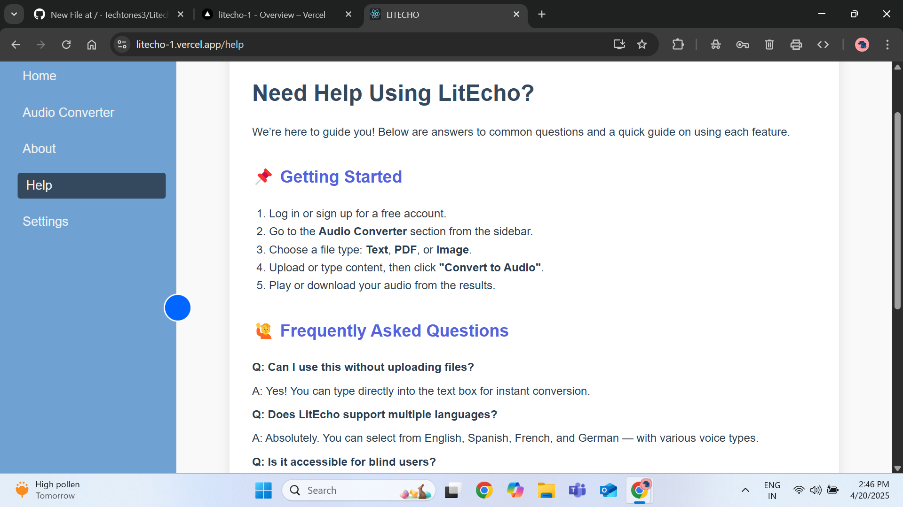
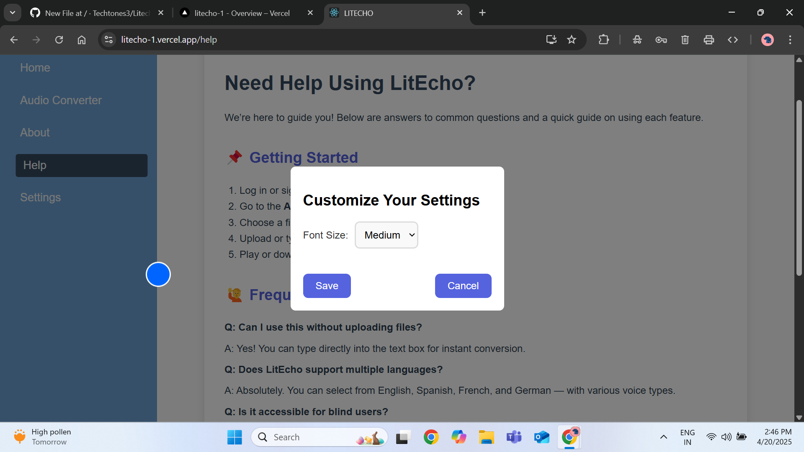
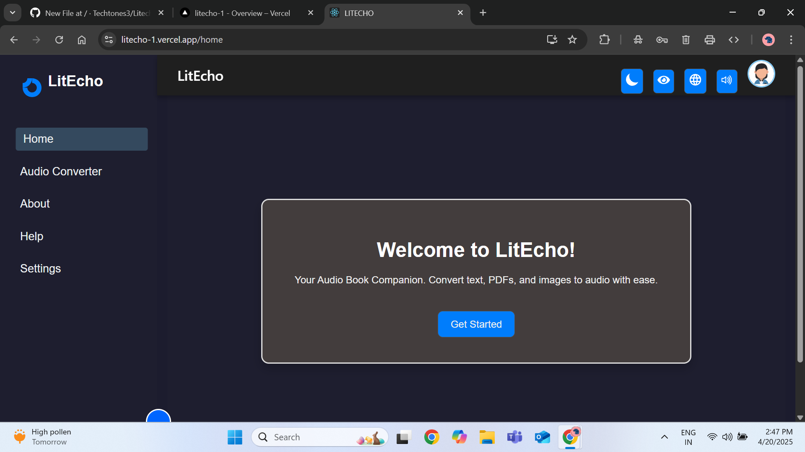

# LitEcho - Text & File to Audio Converter

LitEcho is an inclusive full-stack web application that converts text, PDFs, and images into audio. It helps users, especially those with visual impairments, to easily transform written content into spoken words.

---

## 🌟 Features

- 🎤 Convert **Text / PDF / Image** to audio
- 🖼️ OCR support for scanned documents
- 🌐 Translate text to different languages before conversion
- 🗣️ Voice customization with regional options
- 🌓 Dark Mode & Color-Blind Mode for accessibility
- 📁 Audio download and categorized playback history

---

## 🚀 Live Demo

👉 Try it here: [https://litecho-1.vercel.app](https://litecho-1.vercel.app)

---

## 🖼️ Screenshots

### ✅ Home Page  


### 🎧 Audio Converter Modes  


### 🔊 Voice & Language Options  
  


### ⏩ Playback Speed Control  


### 📄 PDF & 🖼️ Image to Audio  
  


### 📂 Audio History  
  
  


### ℹ️ About, Help & Settings  
  
  


### 🌙 Dark & Color-Blind Modes  
  


### 🌐 Google Translate Integration  


---

## 🧱 Tech Stack

- **Frontend**: React + Tailwind CSS
- **Backend**: Flask + SQLAlchemy
- **OCR**: Tesseract via `pytesseract`
- **TTS**: edge-tts
- **Deployment**: Vercel (frontend), Render (backend)

---

## 📦 Setup Instructions

### Backend (Flask)
```bash
cd flask-backend
python -m venv venv
source venv/bin/activate  # On Windows: venv\Scripts\activate
pip install -r requirements.txt
python app.py
```

### Frontend (React)
```bash
cd frontend
npm install
npm run dev
```

---

## 🐳 Docker (Optional)

```bash
cd flask-backend
docker build -t litecho-backend .
docker run -p 5000:5000 litecho-backend
```

---

## 🧭 Navigation

- `/home` – Welcome Page  
- `/convert` – Audio Converter  
- `/about` – About the App  
- `/help` – User Guide & FAQs  
- `/settings` – Accessibility Settings

---


## 🙋‍♀️ Developed By

**Ragasri Lakshmi Kakarla**
**Mohammed Momin Khizar Uddin**
**Mounika Narra**
**Deepthi Tanubuddi**
