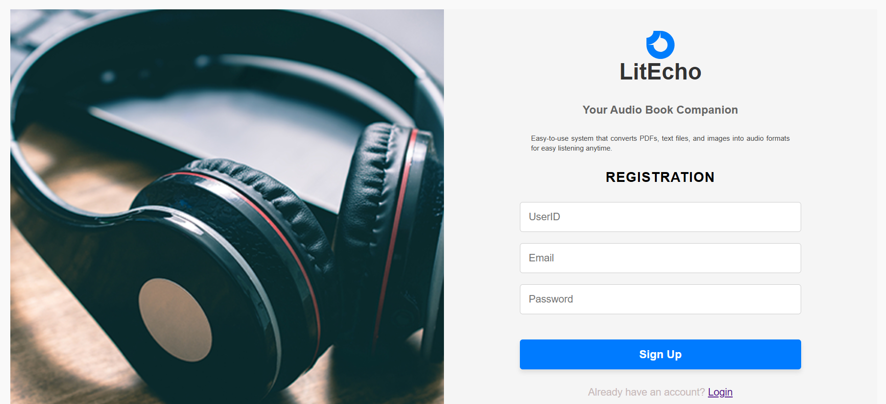
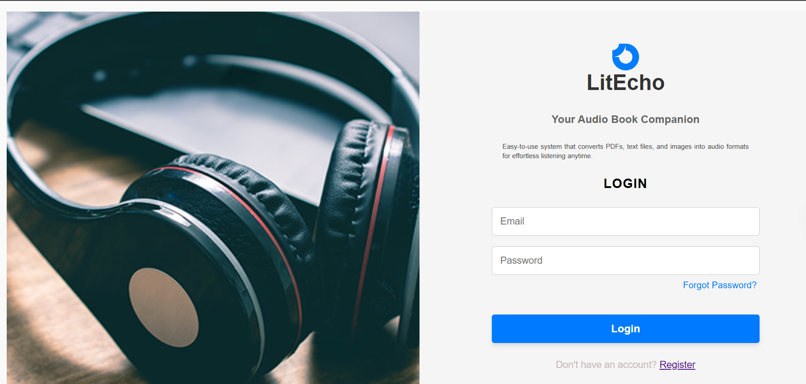
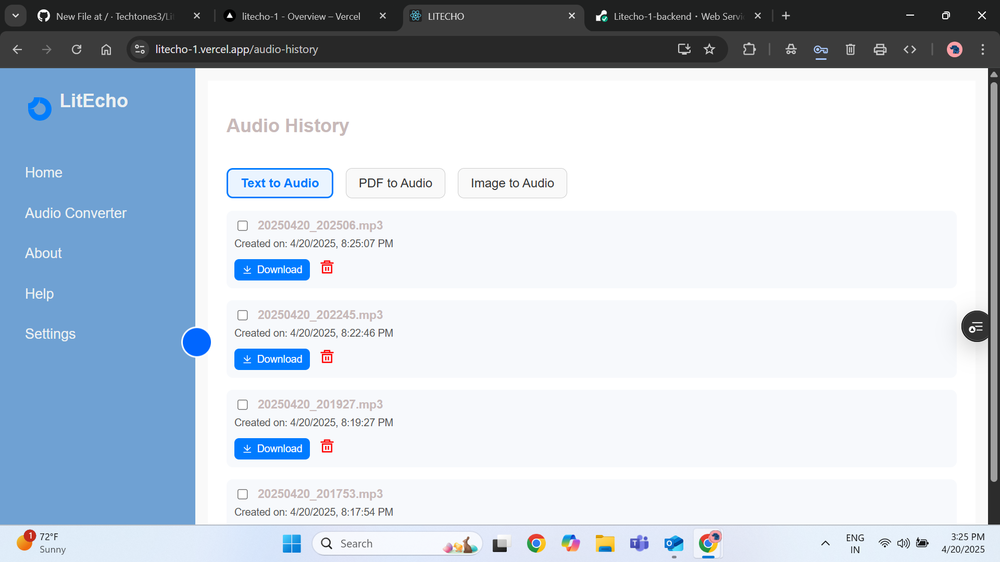
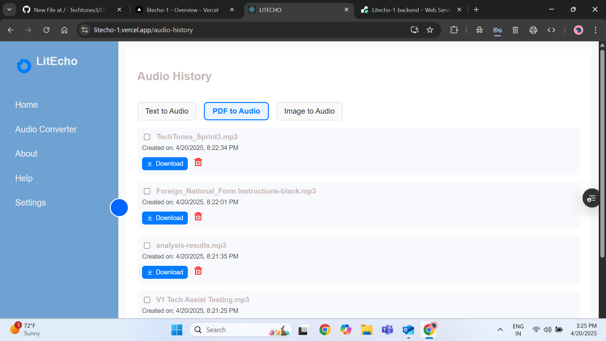
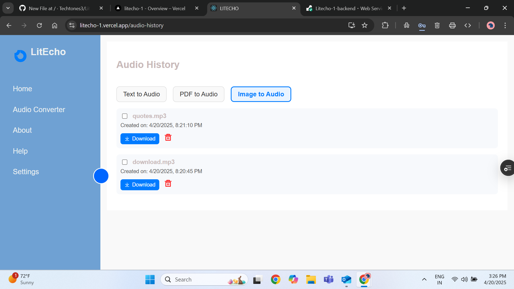
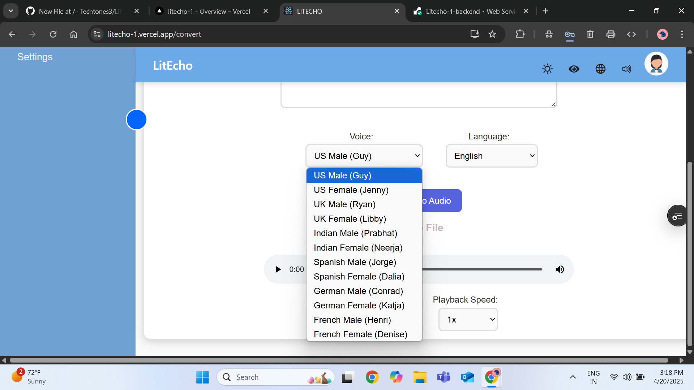
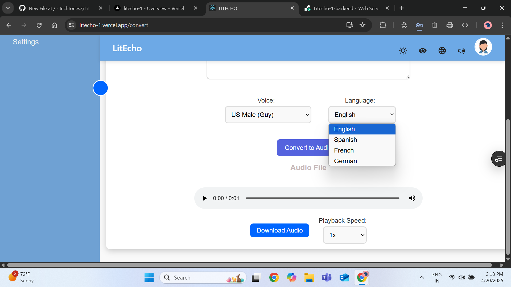
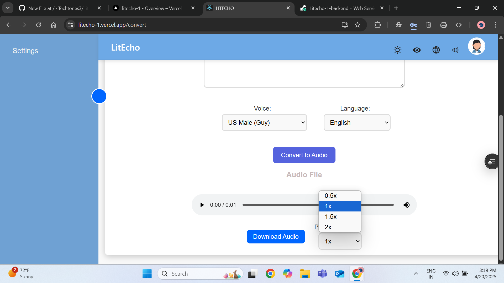

# LitEcho - Your Audio Book Companion

LitEcho is an inclusive audio conversion platform that helps users convert **PDFs, text files, and images into audio formats** with ease. Whether you want to listen to documents on the go or require accessibility features, LitEcho is designed for everyone especially for Blind users.

---

## 🔐 User Registration and Login




Start by registering a new account or logging into your existing one. Simple forms make it easy to get started.

---

## 🏠 Home Page


The welcome screen guides you to begin converting files quickly.

---

## 📖 About Page


Learn more about the mission of LitEcho, its accessibility features, and core functionalities.

---

## 🙋 Help Page


Quickly get started with instructions and answers to frequently asked questions.

---

## 🎨 UI Customization & Theme


Personalize your experience with **Dark Mode**, **Color-Blind Contrast Mode**, and adjustable **font sizes**.

---

## 🎧 Audio Converter

Convert content easily using the converter interface.

| Text to Audio | PDF to Audio | Image to Audio |
| ------------- | ------------ | -------------- |
|  |  |  |

---

## 🗣️ Voice & Language Selection

### Voice Options



### Language Selection



Choose from multiple languages and voices including English, Spanish, German, and French — both male and female voices.

---

## 🔊 Download & Playback Speed



Control how fast the audio plays and download the file for offline listening.

---

## 🕑 Audio History

| Text History | PDF History | Image History |
| ------------ | ----------- | ------------- |
|  |  |  |

---

## 🎨 Accessibility: Color Contrast Support


Accessible UI helps users with visual impairments navigate with ease.

---

## 🌍 Multilingual Support

LitEcho supports a variety of languages and accents to cater to a global audience.

---

## 🚀 Get Started

Visit the live version: [https://litecho-1.vercel.app](https://litecho-1.vercel.app)

---

## 🧰 How to Run Locally

### Backend (Flask)

```bash
# Clone the repository and navigate to the backend folder (if separated)
python -m venv venv
source venv/bin/activate  # Windows: venv\Scripts\activate
pip install -r requirements.txt
python app.py
```

Runs at: [http://localhost:5000](http://localhost:5000)

### Frontend (React)

```bash
npm install
npm run dev
```

Runs at: [http://localhost:3000](http://localhost:3000)

---

## 🌐 Deployment

### Frontend

- Hosted on **Vercel**
- URL: [https://litecho-1.vercel.app](https://litecho-1.vercel.app)

### Backend

- Hosted on **Render**
- URL: [https://litecho-1-backend.onrender.com](https://litecho-1-backend.onrender.com)

---

## 👩‍💻 Developed By

**Raga Sri Lakshmi Kakarla**  
**Mohammed Momin Khizar Uddin**
 **Mounika Narra**  
**Deepthi Tanubuddi**